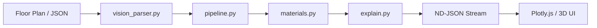

# 🏗️ PlanWise — System Architecture

> **"Architecting the future of structural intelligence through modular design and explainable AI."**

## 1. System Overview
PlanWise is designed as a modular, high-performance structural analysis pipeline. The system decouples **Computer Vision**, **Structural Engineering Logic**, and **AI Reasoning**, allowing each layer to scale independently. The architecture focuses on transforming raw spatial data into actionable, blockchain-verified construction insights with zero-latency streaming.

---

## 2. Data Flow (The Core Pipeline)
The system follows a strict, unidirectional data flow to ensure consistency and speed:

1.  **Input**: Users provide a floor plan image or a specific geometric JSON.
2.  **Orchestration**: `pipeline.py` synchronizes the flow between modules.
3.  **Intelligence**: `materials.py` determines structural requirements, followed by `explain.py` adding human-readable justifications.
4.  **Live Interaction**: Data is streamed in chunks to the frontend for real-time rendering.

---

## 3. Components Breakdown

### 🔘 A) Input Layer
*   **Formats**: Accepts structured JSON geometry or raw JPG/PNG blueprints.
*   **Data Points**: Captures room dimensions (`width`, `length`), wall segments, and room classifications (e.g., Living, Bedroom).

### ⚙️ B) Processing Layer (`pipeline.py`)
*   **Orchestrator**: Acts as the central nervous system, managing the transformation of raw coordinates into enriched structural objects.
*   **ND-JSON Streaming**: Encodes data into chunks (Phases) to allow the UI to start rendering the layout before the deep AI analysis is even finished.

### 🧠 C) Intelligence Layer
*   **`materials.py` (Decision Logic)**: Executes a physics-based rule engine. It calculates span lengths and load distribution to select the optimal material.
*   **`explain.py` (Reasoning Generation)**: A specialized LLM layer (Gemma-3) that interprets the structural choices and translates them into professional engineering reports.

### 📄 D) Output Layer
*   **Structured JSON**: Produces a comprehensive schema including risk scores, material tradeoff matrices, and unique report hashes.
*   **Blockchain Integration**: Hashes (SHA-256) are committed to the Stellar Testnet for immutable verification.

### 🎨 E) Visualization Layer
*   **3D Rendering**: Powered by Plotly.js, converting 2D coordinates into 3D Mesh objects.
*   **Interactive UI**: A glassmorphic dashboard built with vanilla JavaScript for maximum performance and cross-browser stability.

---

## 4. Decision Logic (Rule-Based Engine)
Unlike "black-box" models, PlanWise uses a **Transparent Rule System** that mirrors real-world engineering standards:

- **Load Bearing Walls**: Identified by spans > 4.5m or central placements → Recommended: **RCC / Reinforced Concrete**.
- **Long Spans**: Open areas with significant widths → Recommended: **Structural Steel / I-Beams**.
- **Internal Partitions**: Non-load-bearing segments → Recommended: **AAC Blocks / Red Bricks**.

> [!TIP]
> **Extendability**: The logic is contained in `materials.py` with clear threshold variables, making it easy to adapt for different building codes or regional materials.

---

## 5. Explainability Layer: Beyond the "Why"
In structural engineering, the "why" is more important than the "what." Our Explainability Layer:
- **Engineering Reasoning**: Explains *why* Steel was chosen over RCC (e.g., "To handle excessive tensile loads across an 8m span").
- **Human-in-the-Loop**: Empowers architects to verify suggestions rather than blindly following a software prompt.

---

## 6. UI Architecture
The frontend is split into three high-interaction zones:
1.  **Left Sidebar (Input/Control)**: Handles file uploads and analysis triggers.
2.  **Main Viewport (3D Engine)**: Renders the structural model with 5-Phase Autoplay.
3.  **Right Panel (Data Intelligence)**: Displays real-time analysis results, material scores, and blockchain status.

---

## 7. Integration & Concerns
*   **Separation of Concerns**: The backend focus is purely on data computation; the frontend handles all visualization logic.
*   **RESTful Sync**: Communication is handled via a streaming `/analyze` endpoint and a polling `/verify` endpoint, ensuring the UI remains responsive during long blockchain ledgers.

---

## 8. Scalability & Evolution
PlanWise is built with future growth in mind:
- **ML Integration**: The rule-based engine can be augmented with Neural Networks for complex load-simulation.
- **CAD APIs**: Built-in support for expanding into `.dwg` parsing.
- **Real-time Collaboration**: The modular state-tree in the frontend is ready for WebSocket integration to enable multi-user sessions.

---
*PlanWise Architecture Document - High Performance Structural Intelligence*
